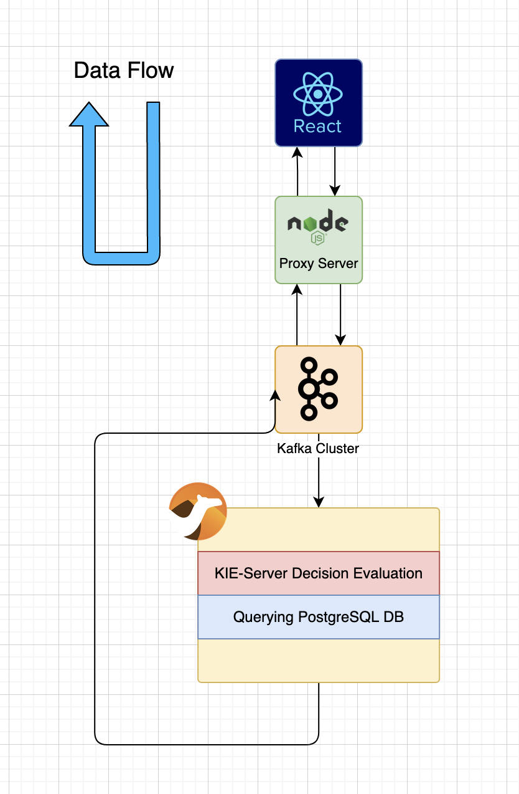

# React-Kafka-Camel-Integration

This repository contains all the project files required to run React App with full end-to-end communication to a Back-end Service with a Kafka Message Broker in-between and a proxy server sitting in between the React App and Kafka Cluster.

## Table of Contents
  - [Repository Structure](#-repository-structure)

## Repository Structure

### This repository containes 3 projects: 

  - Camel Preprocessor:
    A java project which uses Apache Camel along with Spring Boot to allow integration between Kafka Cluster running on localhost:9092 and Microservices, in this case: 
    1. KIE-Server running on localhost:8080 
    2. PostgreSQL Database running on localhost:5432
 
  - NodeJS Proxy Server:
    A NodeJS server which uses Express framework which exposes a REST Api for front-end app clients to send HTTP requests to and the KafkaJS library which allows the server to connect to the Kafka Cluster.

  - ReactApp:
    A React front-end application which allows end-users to send HTTP requests to the Proxy Server which processes the user requests and provides a meaningful user-interface for the users.

## Project Structure
**A high level overview of the project**

The diagram shows how the services are connected and how the data flows starting from React app, top to bottom, right to left.  

## Prerequisites and Setting up the Environment

- JDK 11
- NodeJS v12.x - v14.x(preferred) with NPM

### Setting up the PostgreSQL server

 - Download and install the recent version of the postgreSQL server if you do not have one.
 - set the password for postgres username as "password" for this demo or you can set it to any password and change the configuration in the camel application. Two files have to be modified
   - A